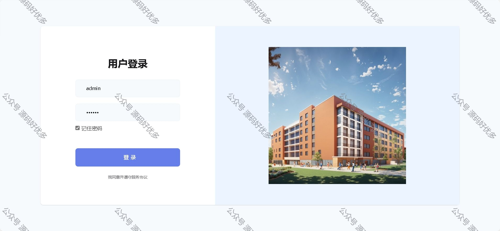
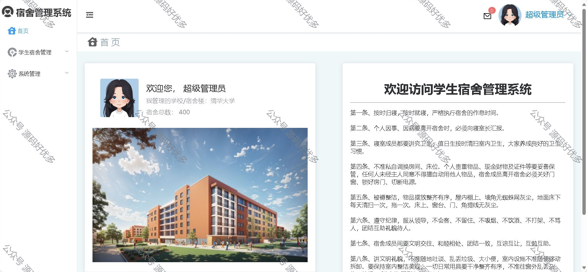
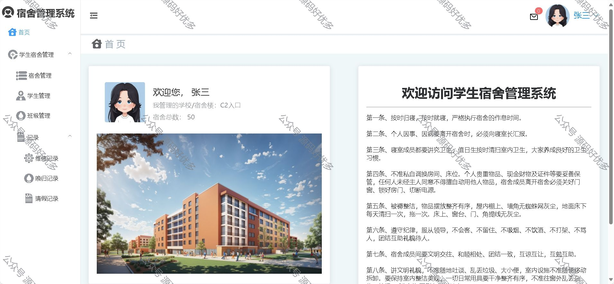
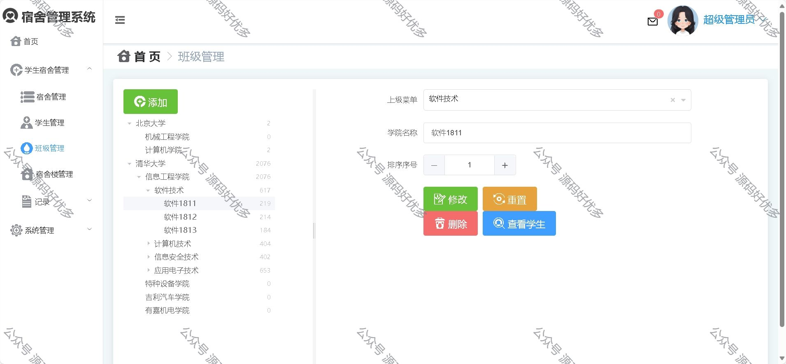
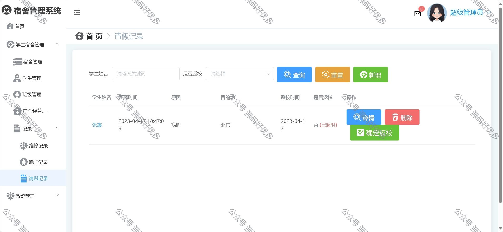
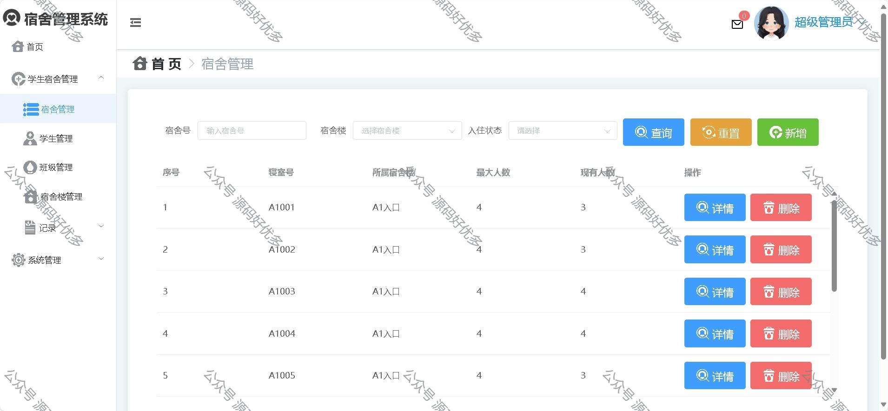
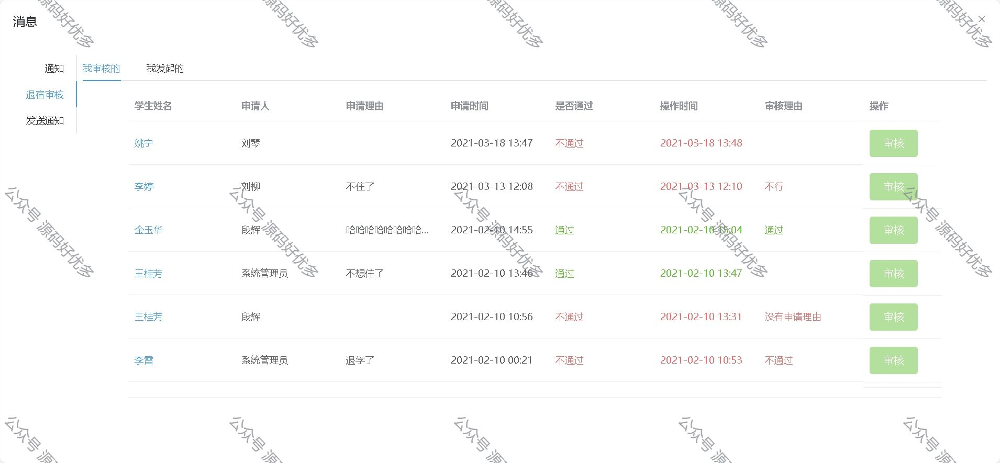
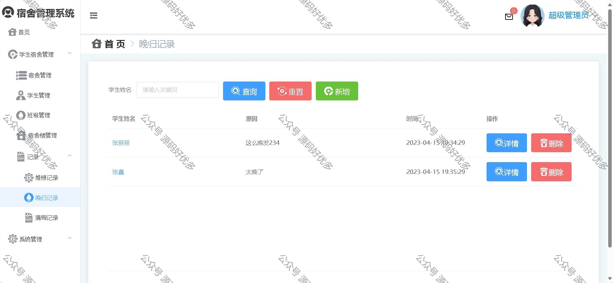
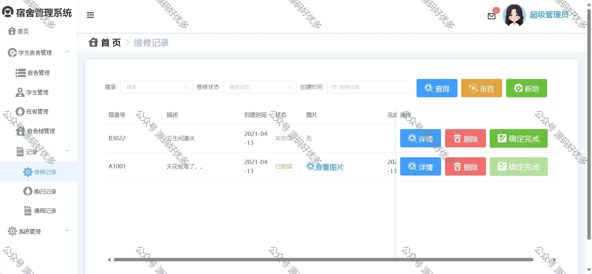
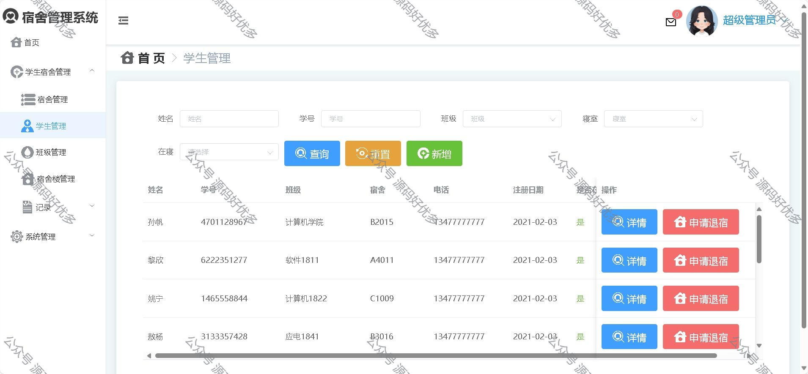

### 一、作品包含

源码+数据库+设计文档+全套环境和工具资源+部署教程

### 二、项目技术

前端技术：Html、Css、Js、Vue、Element-ui

数据库：MySQL

后端技术：Java、Spring Boot、MyBatis

### 三、运行环境

开发工具：IDEA/eclipse

数据库：MySQL8.0

数据库管理工具：Navicat10以上版本

环境配置软件： JDK1.8+Maven3.6.3

前端Nodejs：16

### 四、项目介绍

项目编号：springbootA014

随着学校、企业或其他机构规模的不断扩大，人员流动日益频繁，宿舍管理的复杂性和工作量也显著增加。传统的手工管理方式效率低下、容易出错，且难以满足对宿舍资源的合理分配、住宿人员信息的准确记录与快速查询、费用管理的清晰核算等需求。在学校环境中，学生数量众多，宿舍类型多样，需要对学生的住宿安排进行统筹规划，以保障学生的生活秩序和安全。同时，学校还需要及时处理宿舍维修、卫生检查等各类事务。
基于Java 的宿舍管理系统功能：超级管理员、系统管理员、用户、登录、注册、宿舍管理、学生管理、班级管理、宿舍楼管理、维修记录、晚归记录、请假记录、用户管理、角色管理、菜单管理、日志管理、我收到的、退宿审核、等等等

### 五、运行截图

